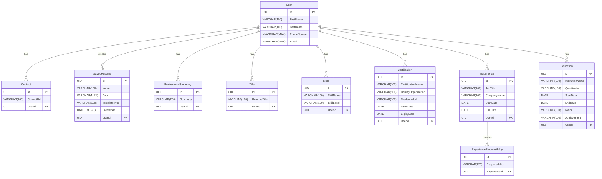

# Ostentans Resume Creator

## Overview

**Ostentans** (Latin for showing off) is a **resume management system** built with .NET Core and Entity Framework, designed to create, manage, and generate professional resumes.

## Purpose

This application serves as a **portfolio of evidence** for the **1Nebula Software Developer Internship program** showcasing:

- **Clean architecture** using the [Onion Architecture](#architecture) while following **SOLID principles**
- **RESTful API** development with ASP.NET Core
- **Code-first** approach with EF Core
- **Identity Management** with ASP.NET Core Identity
- **PDF Generation** capabilities using [QuestPDF](https://www.questpdf.com/)

## Technologies and Tools

### Backend Framework

- **.NET 8.0** - Core framework
- **ASP.NET Core Web API** - RESTful API development
- **Entity Framework Core** - ORM for database operations
- **ASP.NET Core Identity** - Authentication and authorisation

### Database

- **SQL Server** - Primary database engine
- **Entity Framework Migrations** - Database schema management

### Additional Libraries

- **QuestPDF** - PDF generation ([Community License](https://www.questpdf.com/license/))
- **Swagger/OpenAPI** - API documentation

### API Tools

- **Bruno (Bru files)** - API testing and documentation

### Architecture Pattern

- **Clean Architecture** with distinct layers:
  - `Portfolio.Core` - Domain entities and business logic
  - `Portfolio.Application` - Application services and use cases
  - `Portfolio.Infrastructure` - Data access
  - `Portfolio.WebApi` - API controllers
  - `Portfolio.Tests` - Test suite

## Database Schema

The application uses **SQL Server** with the following main entities:

- **ApplicationUser** - User management with Identity
- **Experience** - Work experience
- **ExperienceResponsibility** - Work experience responsibilities
- **Education** - Educational background
- **Skill** - Technical and soft skills with proficiency levels
- **Certification** - Professional certifications
- **Contact** - Social media links
- **ProfessionalSummary** - Resume summary/objective
- **Title** - Resume titles/headings
- **SavedResume** - Saved resume data

## Configuration & Setup

### Prerequisites

Before running the application, ensure you have:

1. **.NET 8.0 SDK** installed

   ```
   # Verify installation by running the following command in your cmd
   dotnet --version
   ```

2. **SQL Server** ([Express LocalDb](https://learn.microsoft.com/en-us/sql/database-engine/configure-windows/sql-server-express-localdb?view=sql-server-ver16) should be sufficient)

   - Ensure you have a local database instance called MSSQLLocalDb created
     - Use the command `sqllocaldb info` to view your instances
   - [SQL Server Management Studio](https://learn.microsoft.com/en-us/ssms/install/install) (recommended)

3. [**Visual Studio 2022**](https://visualstudio.microsoft.com/), or [**VS Code**](https://code.visualstudio.com/) with C# and C# Dev Kit extensions

### Environment Configuration

1. **Clone the repository:**

   ```
   git clone https://github.com/CameronHN/1neb-internship-poe.git
   cd 1neb-internship-poe
   ```

2. **Configure Database Connection:**

   Verify (or update if using a different database instance) `appsettings.json` in the `Portfolio` project:

   ```
   {
     "ConnectionStrings": {
       "DefaultConnection": "Server=(localdb)\\mssqllocaldb;Database=PortfolioDB;Trusted_Connection=true;MultipleActiveResultSets=true"
     }
   }
   ```

3. **Install Dependencies:**

   ```
   dotnet restore
   ```

4. **Apply Database Migrations:**

   ```
   # From the root directory
   dotnet ef database update --project Infrastructure --startup-project Portfolio
   ```

   ```
   # If unsuccessful
   # Use Visual Studio and the Package Manager Console
   # Tools > NuGet Package Manager > Package Manager Console
   # From the dropdown for Default project, select Portfolio.Infrastructure
   update-database
   ```

5. **Build the Solution:**
   ```
   dotnet build
   ```

### Running the Application

1. **Start the API:**

   ```bash
   cd Portfolio
   dotnet run
   ```

2. **Access the Application:**

   - **API Base URL:** `https://localhost:7165` or `http://localhost:5077`
   - **Swagger Documentation:** `https://localhost:7165/swagger`

3. **CORS Configuration:**

   The application is configured to accept requests from:

   - `http://localhost:5173` ([Vite/React frontend](https://github.com/CameronHN/1neb-internship-poe-frontend))

### Database Seeding

The application includes automatic database seeding with initial data. This runs automatically on startup through the `DbInitialiser` service. This is deterministic and will not automatically reseed every time the application is run.

### API Testing

Use the included **Bruno (.bru)** files for API testing:

- Located in `Portfolio.WebApi/` folders
- Test authentication, CRUD operations, and resume generation
- Import into Bruno API client for interactive testing

## Project Structure

```
├── Portfolio/              # Web API project (Startup)
├── Core/                   # Domain layer (Entities, DTOs, Contracts)
├── Application/            # Application layer (Services, Business logic)
├── Infrastructure/         # Data layer (DbContext, Repositories)
├── Tests/                  # Unit and integration tests
└── Portfolio.WebApi/       # Bruno API test files
```

## Diagrams

### Architecture


### Database


